# 🧭 Guía de Uso de HistoriApp

Bienvenido a **HistoriApp**, una plataforma pensada para aprender historia de forma práctica y visual. A continuación, te mostramos paso a paso cómo empezar a usar la aplicación.

---

## 🔐 Iniciar sesión

Cuando abres la aplicación, verás la siguiente ventana:

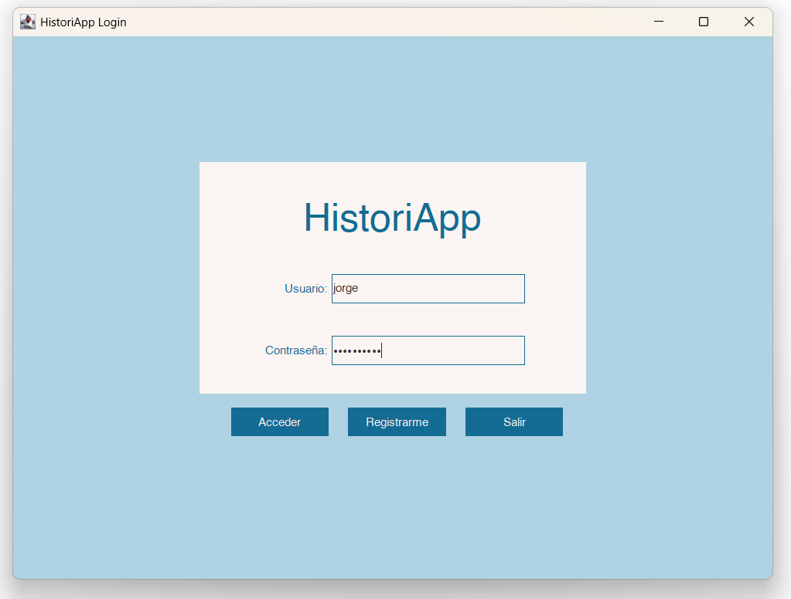

Aquí puedes introducir tu **nombre de usuario** y **contraseña** si ya tienes una cuenta.  
Si todavía no te has registrado, haz clic en el botón **"Registrarse"** para crear una nueva cuenta.

---

## 📝 Registro de nuevo usuario

Al pulsar "Registrarse", se abrirá esta ventana:

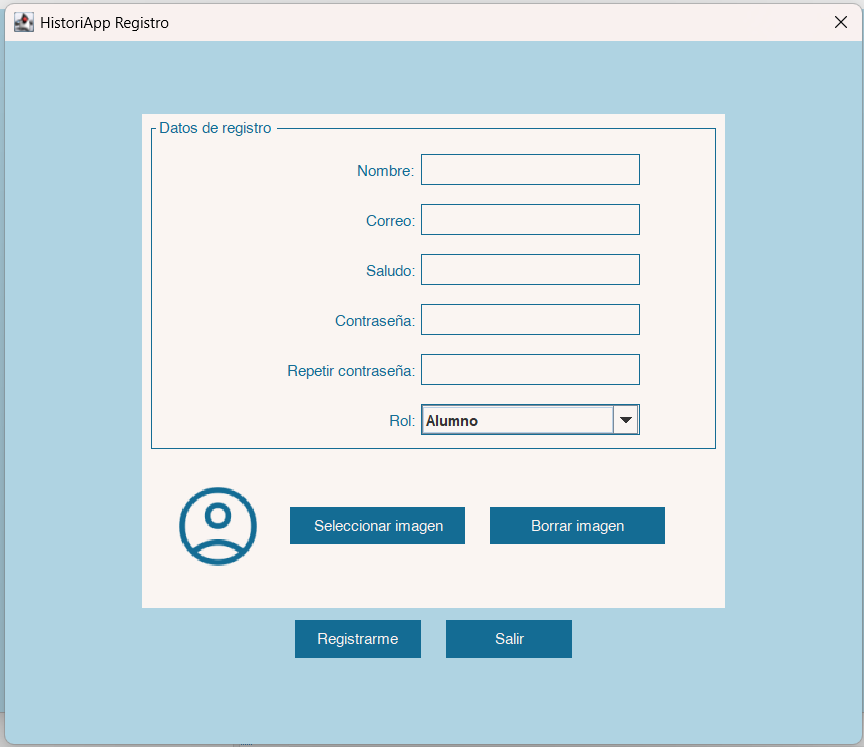

Rellena los campos obligatorios para registrarte correctamente.

Además, puedes añadir una imagen de perfil personalizada pinchando en el botón.

---

## 🖼️ Añadir una imagen de perfil

Para personalizar tu cuenta con una imagen de perfil:

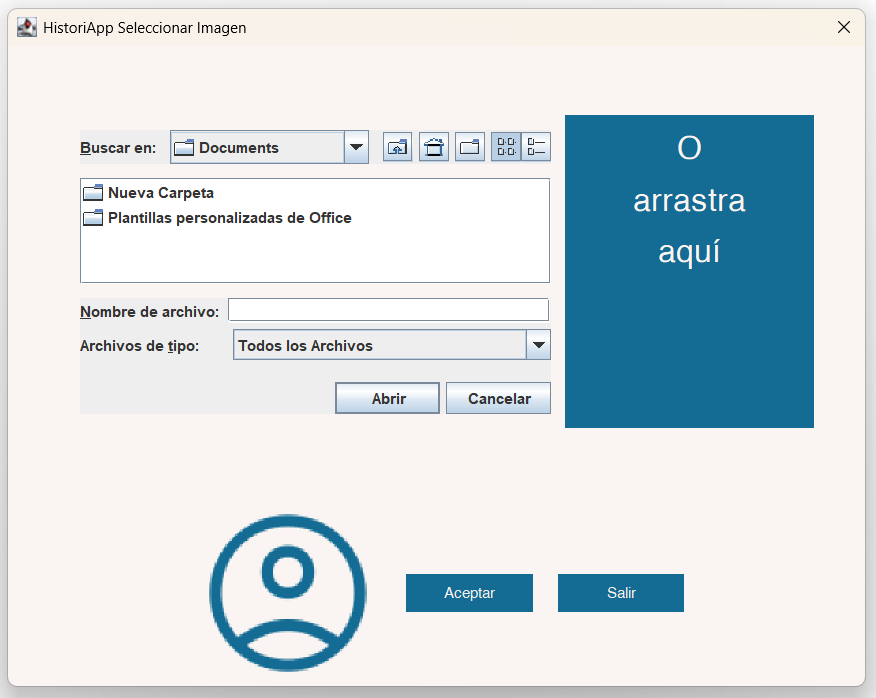

- Puedes **seleccionar una imagen desde tu dispositivo** usando el explorador de archivos.
- O bien **arrastrar la imagen directamente** al área de la derecha.

Esto le dará un toque más personal a tu perfil.

---

## 📚 Explorar cursos disponibles

Una vez que te hayas registrado e iniciado sesión, accederás a la siguiente pantalla:

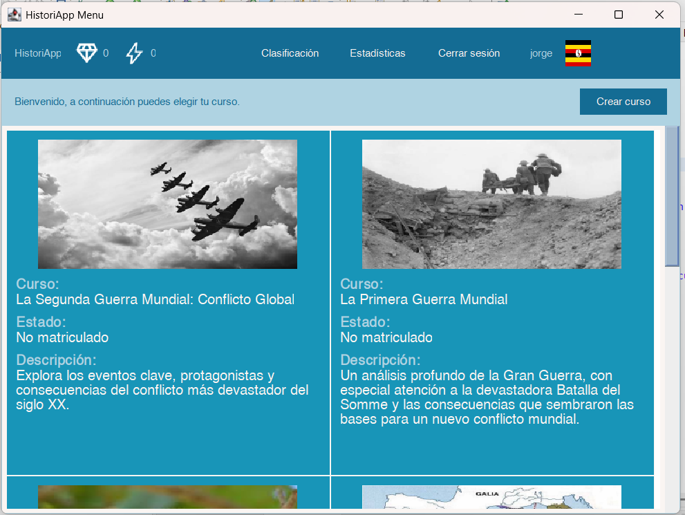

Aquí puedes:
- Ver todos los cursos disponibles
- Leer una breve **descripción** de cada uno
- Ver sus **imágenes de portada**
- Hacer doble clic en el curso que quieras comenzar

---

## 📥 Matricularte en un curso  
Al hacer doble clic sobre un curso te aparecerá la siguiente ventana emergente:

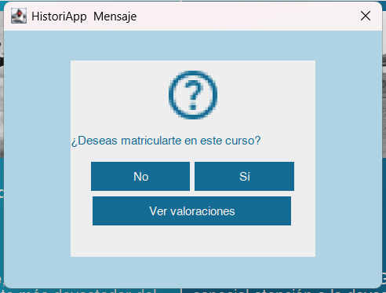

Antes de matricularte, puedes consultar las valoraciones de un curso pinchando en el botón. Al hacerlo, te aparecerá la siguiente pantalla:  

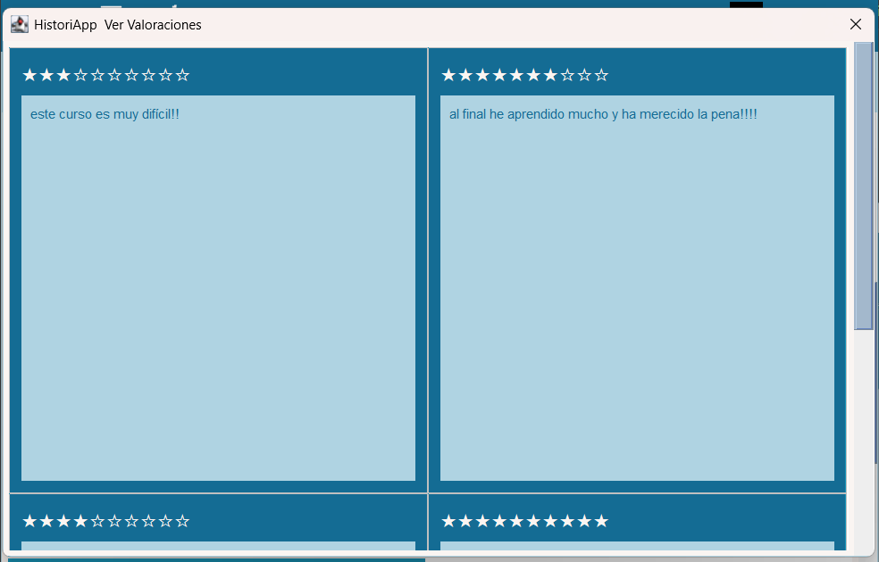

Si decides matricularte, pulsa el botón **"Aceptar"**.  
Esto te permitirá acceder a los contenidos del curso.  

## 🧱 Navegar por los bloques de contenido

Después de registrarte en un curso, podrás acceder a él haciendo doble clic y pulsando **"Aceptar"**. Entrarás entonces a la vista de bloques de contenido:

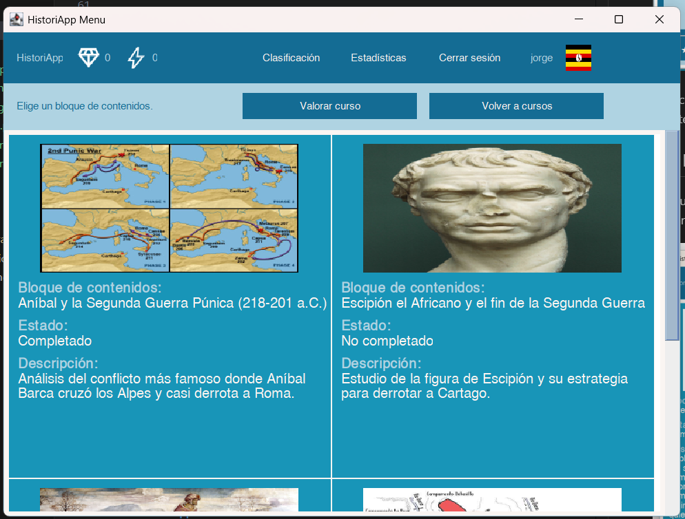

En esta pantalla podrás:
- Ver todos los bloques disponibles del curso
- Hacer clic en uno para comenzar a estudiarlo.
- Seguir tu progreso de forma visual y ordenada
- Dejar reseñas sobre el curso. Nótese que esto sólo será posible cuando hayas cursado parcialmente el curso: al menos un bloque de contenidos. Para dejar una reseña, debes pulsar el botón **"Valorar curso"**. Te aparecerá la siguiente pantalla:

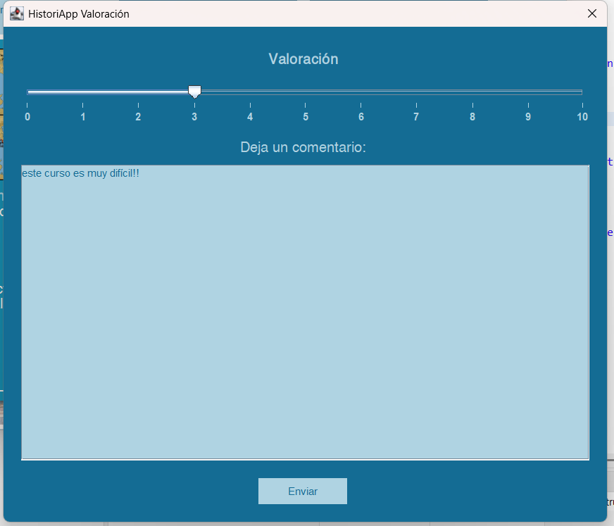

---

## 🧱 Cursar un bloque de contenidos

Para completar un bloque de contenidos, es necesario realizar **todas las tareas** asociadas. Estas tareas pueden incluir distintos tipos de ejercicios interactivos:

### 💡 Tip (Consejo)
Se presenta un consejo o explicación breve para ayudar a comprender el tema.  

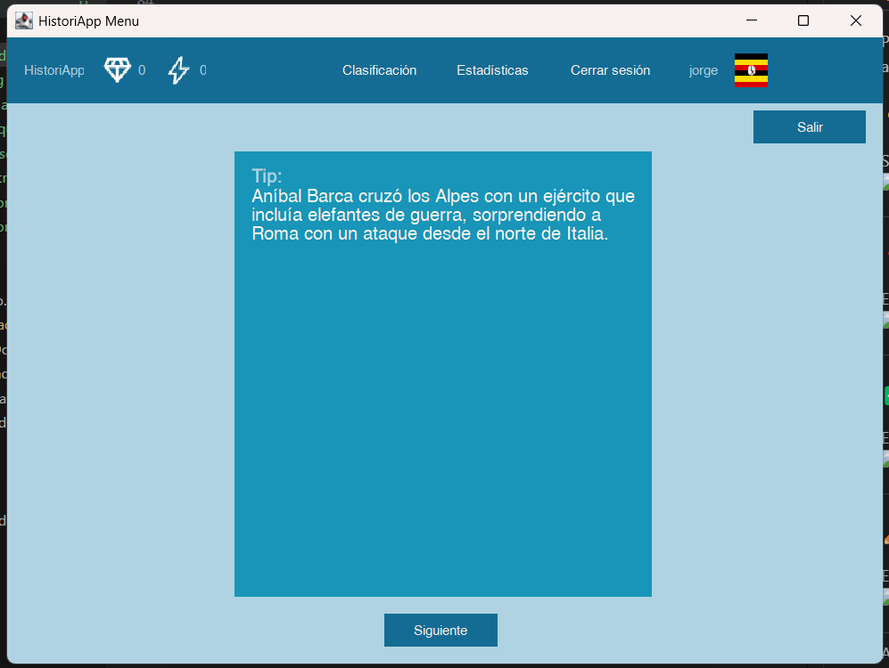

---

### ❓ Pregunta tipo test
El usuario debe seleccionar la opción correcta entre varias posibles.  

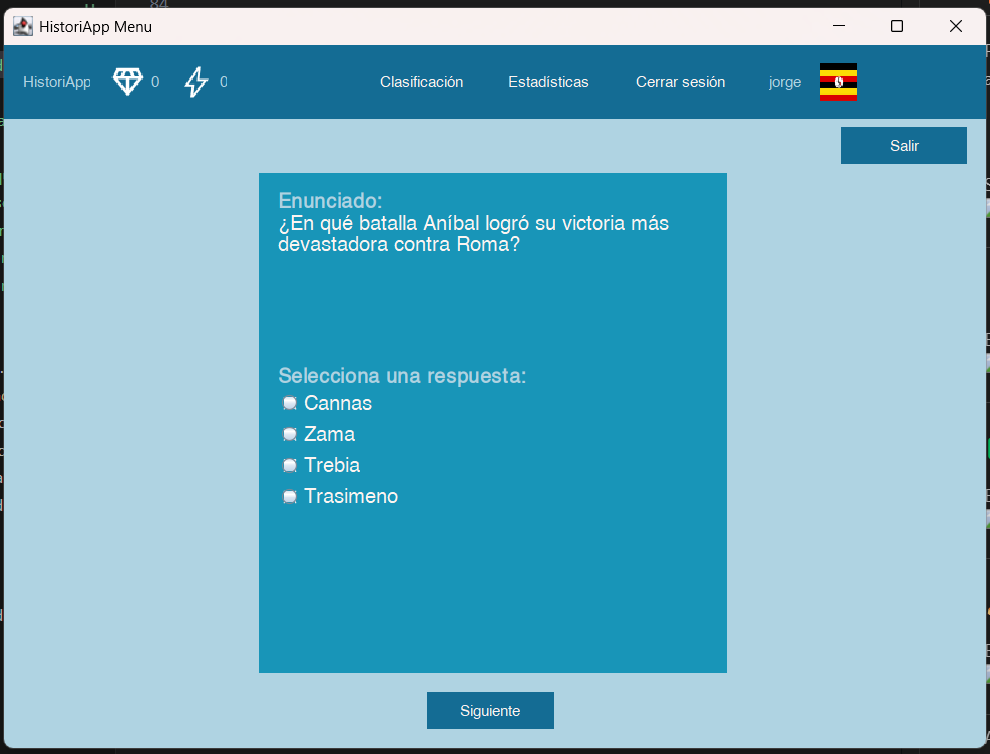

---

### ✅ Pregunta de verdadero o falso
El usuario elige si una afirmación es verdadera o falsa.  

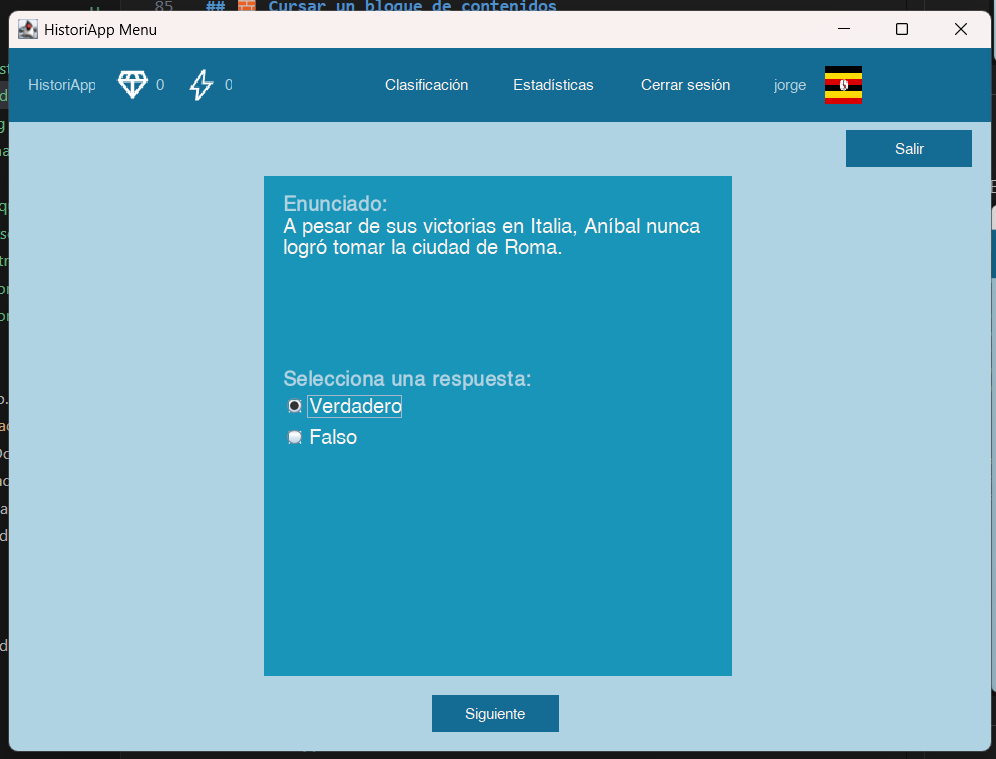

---

### ✏️ Pregunta de rellenar
El usuario debe completar la respuesta escribiendo la palabra o frase correcta.  

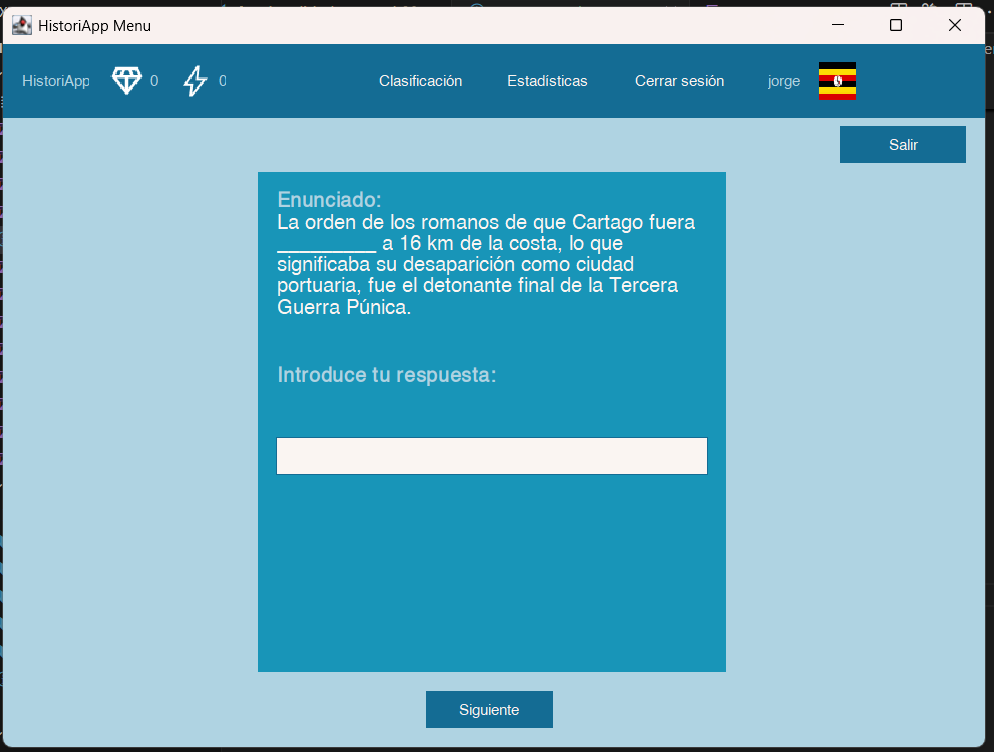

---

Al completar todas las tareas correctamente, el bloque se marca como finalizado y el progreso del curso se actualiza automáticamente. Se te mostrará la puntuación obtenida en el curso.

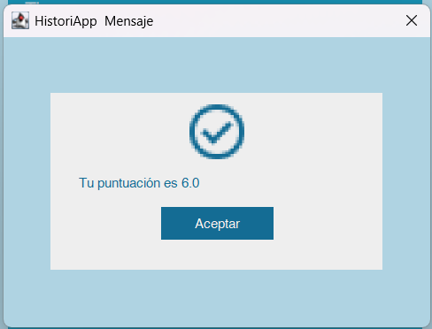

¡Y eso es todo! Ya estás listo para comenzar tu viaje histórico con **HistoriApp**.

