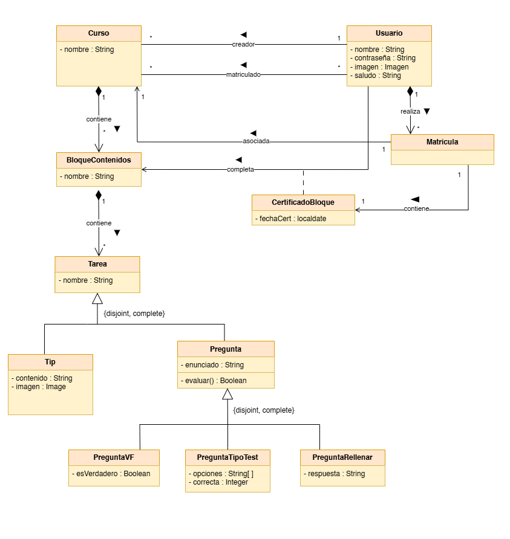

# Modelo de Dominio - HistoriApp

Este diagrama representa el modelo de dominio de la aplicación HistoriApp. El modelo de dominio ilustra las entidades principales del sistema, sus atributos y las relaciones entre ellas, estableciendo la base conceptual sobre la que se construye toda la aplicación.

## Referencias Adicionales

Para más información sobre la arquitectura de la aplicación, consulte:
- [Estructuras y Patrones de Diseño de la Interfaz Gráfica](modeloVista.md)
- [Modelo de Estados y Transiciones](modeloEstados.md)
- [Casos de Uso](casosDeUso.md)