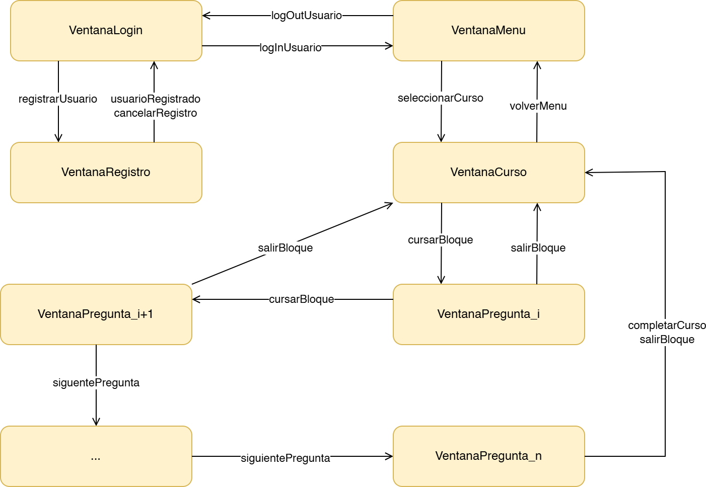

# Modelo de Estados y Transiciones

Este diagrama ilustra la dinámica de la aplicación HistoriApp y los cambios entre ventanas. El modelo de estados representa el flujo de navegación del usuario a través de la aplicación, mostrando las posibles transiciones entre diferentes interfaces y los eventos que las desencadenan.

## Referencias Adicionales

Para más información sobre la arquitectura de la aplicación, consulte:
- [Modelo de Dominio](modeloDominio.md)
- [Estructuras y Patrones de Diseño de la Interfaz Gráfica](modeloVista.md)
- [Casos de Uso](casosDeUso.md)