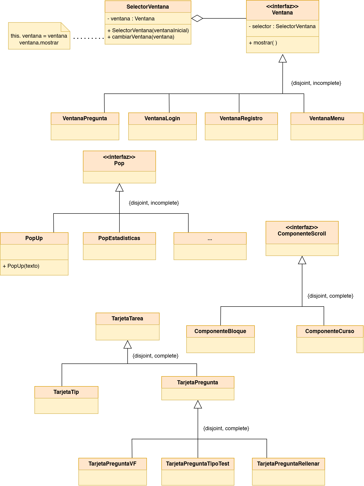

# Estructuras y Patrones de Diseño - Interfaz Gráfica

Este esquema presenta las estructuras y patrones de diseño aplicados en la arquitectura de la interfaz gráfica de HistoriApp. El diagrama muestra la organización de los componentes visuales, su jerarquía y las relaciones que permiten una experiencia de usuario coherente y eficiente.

## Referencias Adicionales

Para más información sobre la arquitectura de la aplicación, consulte:
- [Modelo de Dominio](modeloDominio.md)
- [Modelo de Estados y Transiciones](modeloEstados.md)
- [Casos de Uso](casosDeUso.md)