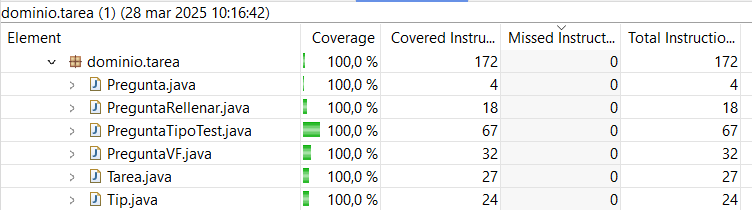

# Pruebas de Software - HistoriApp

Se han realizado pruebas sobre el dominio de la aplicación con el objetivo de alcanzar la mayor cobertura posible. Estas pruebas han permitido evaluar la estabilidad y fiabilidad del sistema en diferentes escenarios.

## Resultados

### Jerarquía Tarea
Se han ejecutado pruebas para verificar la correcta gestión de las tareas dentro del sistema, asegurando la integridad de los datos y el correcto funcionamiento de las relaciones entre entidades. La cobertura obtenida se detalla en la siguiente tabla:

### Jerarquía Curso
Se ha evaluado el manejo de cursos en la aplicación, validando la consistencia de la información y la adecuada gestión de los permisos de acceso para los diferentes tipos de usuarios.

Nótese que falta parte de la funcionalidad de RepositorioCursos y por ello no se han hecho todavía los tests correspondientes.

### Jerarquía Usuario
Las pruebas realizadas sobre la jerarquía de usuarios han permitido verificar los roles y permisos dentro de la aplicación, garantizando una correcta autenticación y control de acceso.
