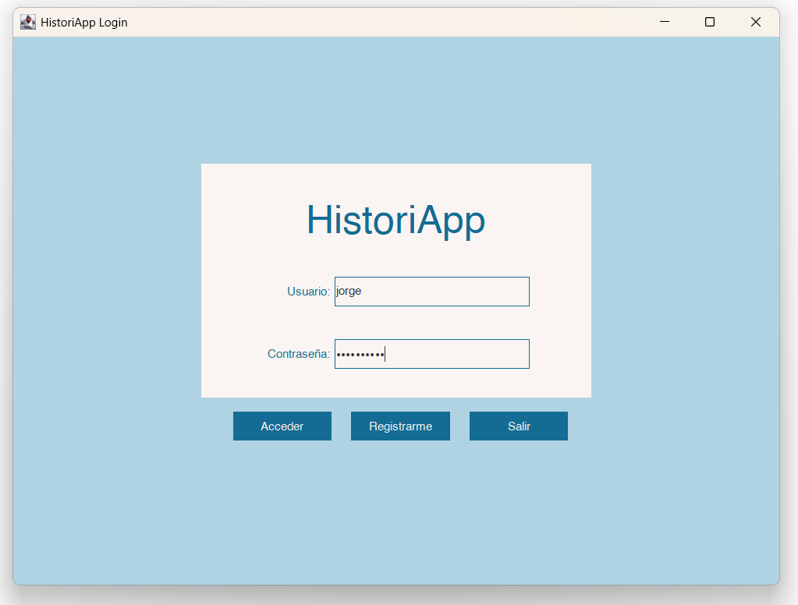
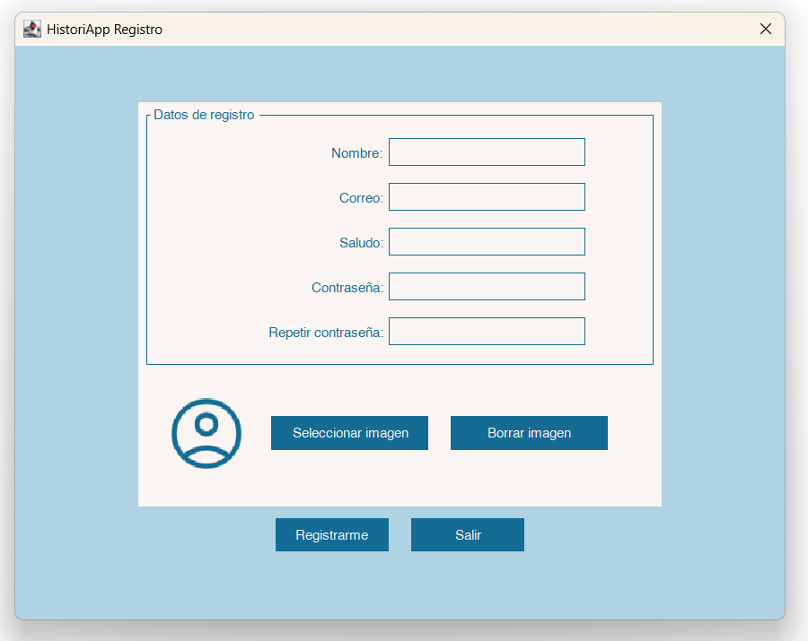
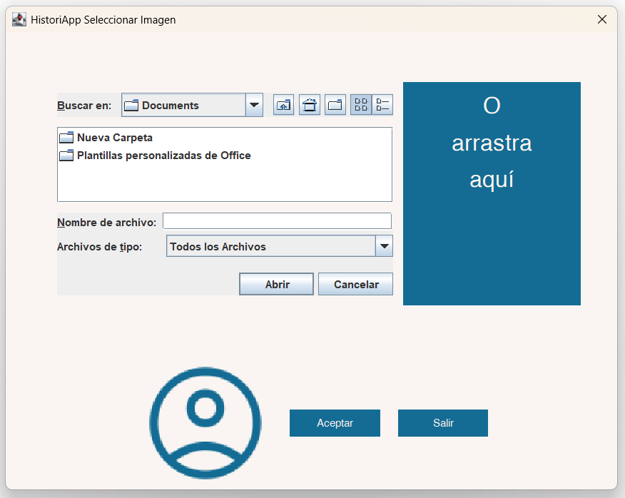
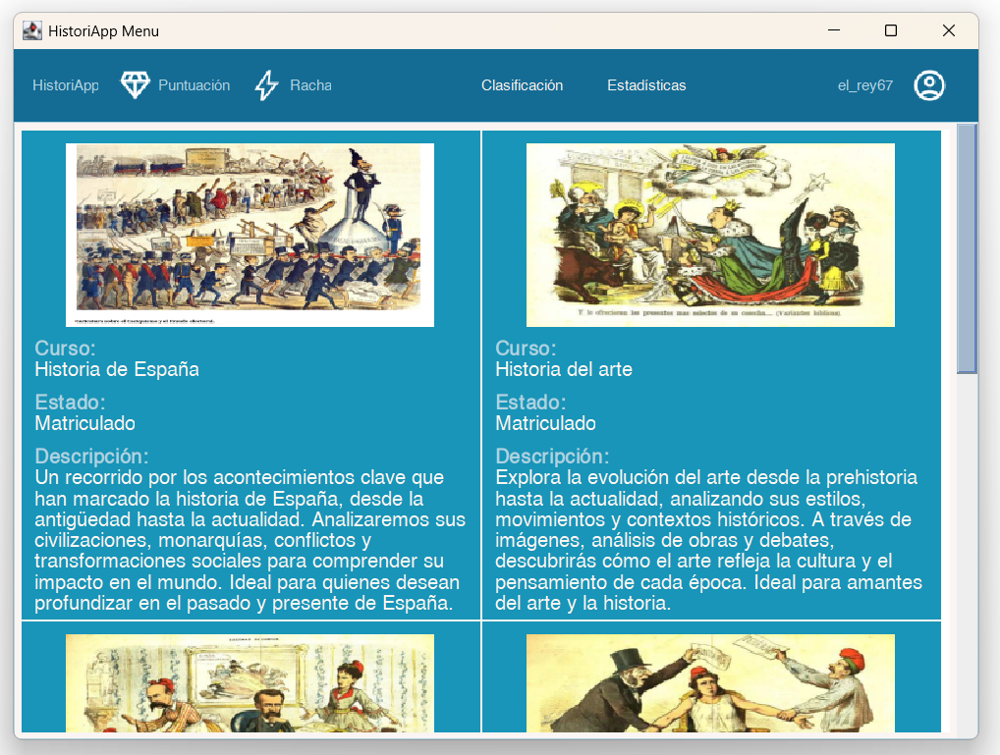
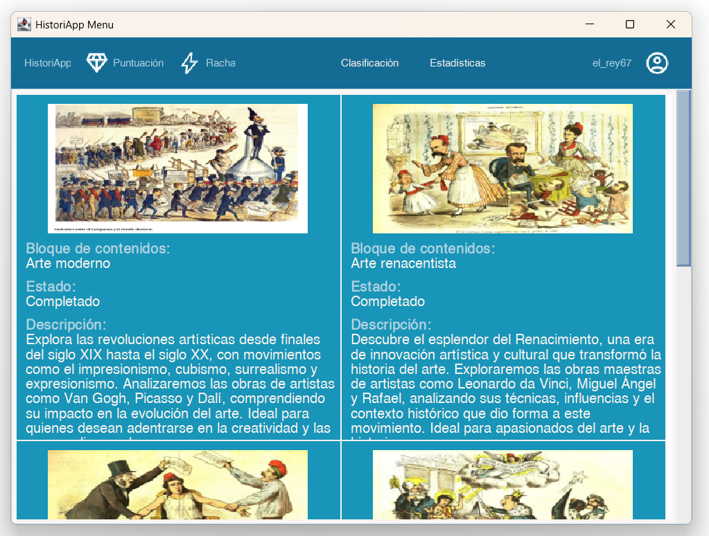

# Diseños de las Vistas del Programa

En esta carpeta se muestran los diseños escogidos para las distintas vistas de la aplicación.

## Ventana de Login
Al iniciar la aplicación, se muestra la ventana de login, donde los usuarios pueden introducir su nombre de usuario y contraseña para acceder.

Si un usuario no está registrado en la plataforma, puede pulsar el botón de registro y acceder a la ventana de registro.

## Ventana de Registro
En la ventana de registro, los usuarios pueden introducir sus datos para crear una nueva cuenta.

Desde esta ventana es posible añadir una imagen de perfil pulsando el botón correspondiente.

## Selección de Imagen
Los usuarios pueden añadir una imagen seleccionándola desde el explorador de archivos o arrastrándola al panel de la derecha.

## Ventana de Cursos
Si un usuario ya está registrado e inicia sesión correctamente, accede a la ventana de cursos, donde puede explorar el catálogo de cursos disponibles junto con sus descripciones e imágenes de portada.

## Ventana de Bloques de Contenidos
Al hacer doble clic en un curso, se accede a la ventana de bloques de contenido, donde se pueden visualizar todos los bloques disponibles y seleccionar uno para cursarlo.

